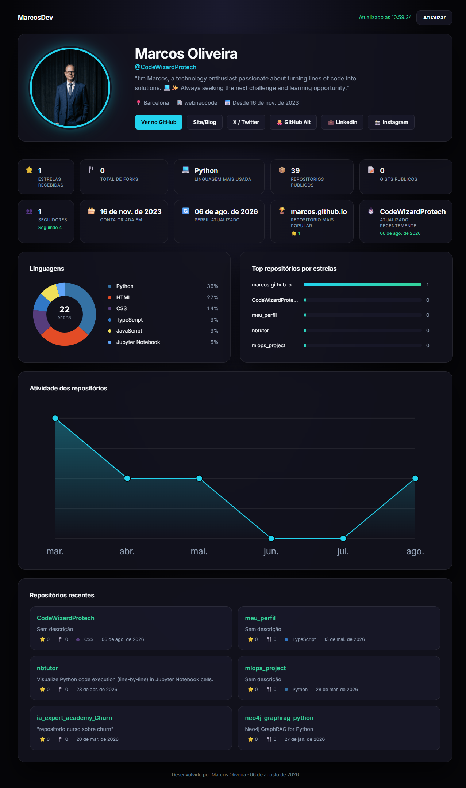

<p align="center">
  
</p>

<p align="center">
  <a href="https://codewizardprotech.github.io/CodeWizardProtech/">
    
  </a>
</p>

<p align="center">
  <a href="https://codewizardprotech.github.io/CodeWizardProtech/">
    
  </a>
  <a href="https://github.com/CodeWizardProtech">
    
  </a>
  <a href="https://github.com/DedicatedDevExpert">
    
  </a>
  <a href="https://www.linkedin.com/in/marcosoliveiraso/">
    
  </a>
  <a href="https://www.instagram.com/marcos.agenteia/">
    
  </a>
</p>

---

<h1 align="center">👋 Hi, I'm Marcos Oliveira</h1>
<p align="center">Developer · Data Scientist · AI Enthusiast · Automation Builder</p>

---

## 📋 Table of Contents

- [About This Project](#-about-this-project)
- [Live Demo](#-live-demo)
- [Project Structure](#-project-structure)
- [Features](#-features)
- [Tech Stack](#-tech-stack)
- [Architecture](#-architecture)
- [Install & Run](#-install--run)
- [Deployment](#-deployment)
- [Git Setup & GitHub CLI](#-git-setup--github-cli)
- [Main Git Commands](#-main-git-commands)
- [Connect with Me](#-connect-with-me)

---

## 📖 About This Project

This is my personal **GitHub Dashboard** — a professional profile page built with **pure HTML, CSS and vanilla JavaScript (ES Modules)**. It fetches real-time data from the **GitHub REST API** and displays stats, charts, and repositories in a responsive dark-themed UI.

No frameworks, no build tools required. Just open `index.html` in any modern browser.

> ✅ Requires **no installation** — just open `index.html` directly in your browser or serve it with any static server.

---

## 🌐 Live Demo

| Page | URL |
|------|-----|
| Dashboard | [codewizardprotech.github.io/CodeWizardProtech/](https://codewizardprotech.github.io/CodeWizardProtech/) |

---

## 📁 Project Structure

```
docs/
├── css/
│   ├── style.css           # Base tokens, layout, buttons
│   ├── profile.css         # Profile header and metric cards
│   ├── repos.css           # Repository list styles
│   ├── charts.css          # Chart section styles
│   └── responsive.css      # 10 breakpoints (320px → 2560px+)
├── js/
│   ├── config.js           # Central config (username, API base, colors)
│   ├── api.js              # GitHub API communication only
│   ├── app.js              # Orchestrator, auto-refresh logic
│   ├── profile.js          # Profile render + metrics computation
│   ├── repos.js            # Repository list render
│   ├── charts.js           # SVG charts render
│   └── utils.js            # Shared helpers (escape, format, etc.)
└── index.html              # Entry point
```

---

## ✨ Features

- **Profile Header** — Avatar with glow animation, bio, location, company, join date
- **Social Links** — GitHub, GitHub Alt, LinkedIn, Instagram
- **Metrics Cards** — Stars, forks, top language, public repos, gists, followers, and more
- **Charts** — Languages pie chart, top repos by stars, repository activity timeline
- **Repository List** — Recent repos with language, stars, forks and last update
- **Auto Refresh** — Data refreshes automatically every 10 minutes
- **Responsive** — 10 breakpoints from 320px to 2560px+, landscape and touch optimized
- **Accessibility** — WCAG 2.1 AA+, keyboard navigation, aria-live, screen reader support
- **Zero Dependencies** — Pure HTML/CSS/JS, no frameworks, no build step

---

## 🛠️ Tech Stack

| Layer | Technology |
|-------|-----------|
| Markup | HTML5 |
| Styling | CSS3 (Grid, Flexbox, Custom Properties) |
| Logic | Vanilla JavaScript (ES Modules) |
| Data | [GitHub REST API v3](https://docs.github.com/en/rest) |
| Fonts | [Inter — Google Fonts](https://fonts.google.com/specimen/Inter) |
| Deployment | [GitHub Pages](https://pages.github.com) |


---

## 🏗️ Architecture

```
Browser Request
      │
      ▼
  index.html
      │
      ▼
  app.js (orchestrator)
      │
      ├── api.js ──────────► GitHub REST API
      │                          │
      │                    { user, repos }
      │                          │
      ├── profile.js ◄───────────┤  renders profile + metrics
      ├── repos.js  ◄───────────┤  renders repository list
      └── charts.js ◄───────────┘  renders SVG charts
```

---

## 🚀 Install & Run

```bash
# Clone the repository
git clone https://github.com/CodeWizardProtech/CodeWizardProtech.git
cd CodeWizardProtech/docs
```

```bash
# Option 1 — Open directly (no server needed)
# Just double-click index.html in your file explorer
```

```bash
# Option 2 — Local server (recommended)
python -m http.server 8000
# Access: http://localhost:8000
```

> **No npm install needed.** The project has zero build dependencies.

---

## 🌍 Deployment

This project is deployed on **Netlify** as a static site. Just point the publish directory to `docs/` and it works out of the box.

```toml
[build]
  publish = "docs"
```

---

## ⚙️ Git Setup & GitHub CLI

**1. Install Git**

Download and install Git from https://git-scm.com, then configure your identity:

```bash
git config --global user.name "Marcos Oliveira"
git config --global user.email "your@email.com"
```

**2. Install GitHub CLI (gh)**

Download from https://cli.github.com and authenticate:

```bash
gh auth login
```

Follow the prompts and choose `GitHub.com → HTTPS → Login with a web browser`.

---

## 📌 Main Git Commands

Clone the repository
```bash
git clone https://github.com/CodeWizardProtech/CodeWizardProtech.git
```

Check the status of your files
```bash
git status
```

Stage your changes
```bash
git add .
```

Commit your changes
```bash
git commit -m "Your message here"
```

Push to GitHub
```bash
git push origin main
```

Pull latest changes
```bash
git pull origin main
```

---

## 🤝 Connect with Me

<p align="center">
  <a href="https://github.com/CodeWizardProtech"></a>
  <a href="https://github.com/DedicatedDevExpert"></a>
  <a href="https://www.linkedin.com/in/marcosoliveiraso/"></a>
  <a href="https://www.instagram.com/marcos.agenteia/"></a>
</p>

| Platform | Link |
|----------|------|
| 🐙 GitHub | [github.com/CodeWizardProtech](https://github.com/CodeWizardProtech) |
| 🐙 GitHub Alt | [github.com/DedicatedDevExpert](https://github.com/DedicatedDevExpert) |
| 💼 LinkedIn | [linkedin.com/in/marcosoliveiraso](https://www.linkedin.com/in/marcosoliveiraso/) |
| 📸 Instagram | [@marcos.agenteia](https://www.instagram.com/marcos.agenteia/) |

---

<p align="center">© 2025 Marcos Oliveira · CodeWizardProtech. All rights reserved.</p>
